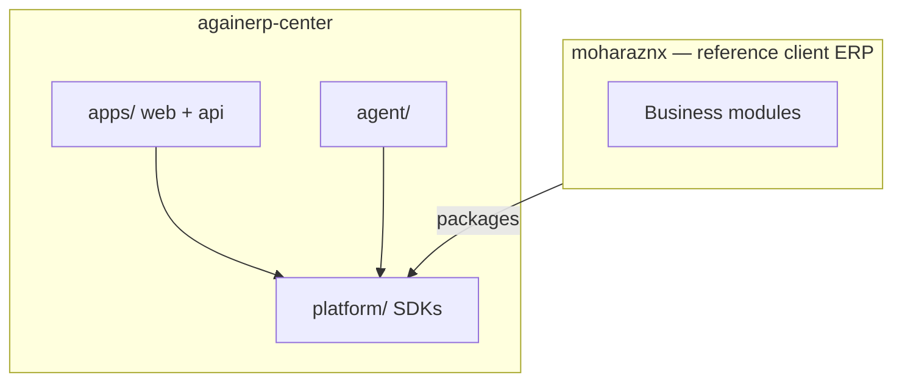

# AgainERP Center — Master Index

> **Project:** AgainERP Center (Platform Brain)  
> **Ecosystem:** Two repositories only — `againerp-center` + `moharaznx`  
> **Architecture:** **FROZEN v1.0.0** (2026-06-30)  
> **Last updated:** 2026-06-30

---

## Mandatory read order

1. [docs/AGAINERP_PLATFORM_CONSTITUTION.md](./docs/AGAINERP_PLATFORM_CONSTITUTION.md)
2. [docs/FROZEN_RULES.md](./docs/FROZEN_RULES.md)
3. [docs/DEVELOPMENT_RULES.md](./docs/DEVELOPMENT_RULES.md)
4. [README.md](./README.md)
5. [MASTER_INDEX.md](./MASTER_INDEX.md) (this file)
6. [PROJECT_MAP.md](./PROJECT_MAP.md)
7. [docs/ARCHITECTURE.md](./docs/ARCHITECTURE.md)
8. [ControlCenter/MASTER_INDEX.md](./ControlCenter/MASTER_INDEX.md)
9. Task-specific documentation

---

## Architecture freeze

| Field | Value |
|-------|-------|
| Architecture Version | **1.0.0** |
| Status | **FROZEN** |
| Platform Brain | AgainERP Center |
| Business ERP Template | MoharazNX |

---

## Start here

| Audience | Document |
|----------|----------|
| **Constitution (read first)** | [docs/AGAINERP_PLATFORM_CONSTITUTION.md](./docs/AGAINERP_PLATFORM_CONSTITUTION.md) |
| **Package ownership** | [docs/PLATFORM_PACKAGE_OWNERSHIP.md](./docs/PLATFORM_PACKAGE_OWNERSHIP.md) |
| **Doc consistency** | [docs/DOCUMENTATION_CONSISTENCY_REPORT.md](./docs/DOCUMENTATION_CONSISTENCY_REPORT.md) |
| All developers | [BRAIN.md](./BRAIN.md) |
| **Governance confirmation** | [docs/PLATFORM_GOVERNANCE_CONFIRMATION.md](./docs/PLATFORM_GOVERNANCE_CONFIRMATION.md) |
| **Platform architecture** | [docs/ARCHITECTURE.md](./docs/ARCHITECTURE.md) |
| **Frozen rules (mandatory)** | [docs/FROZEN_RULES.md](./docs/FROZEN_RULES.md) |
| **Architecture validation** | [docs/ARCHITECTURE_VALIDATION_REPORT.md](./docs/ARCHITECTURE_VALIDATION_REPORT.md) |
| **Architecture freeze** | [docs/ARCHITECTURE_FREEZE_REPORT.md](./docs/ARCHITECTURE_FREEZE_REPORT.md) |
| **Remaining implementation** | [docs/REMAINING_TODO.md](./docs/REMAINING_TODO.md) |
| **Platform developer guide** | [docs/PLATFORM_GUIDE.md](./docs/PLATFORM_GUIDE.md) |
| **Development rules (mandatory)** | [docs/DEVELOPMENT_RULES.md](./docs/DEVELOPMENT_RULES.md) |
| Repository structure | [PROJECT_MAP.md](./PROJECT_MAP.md) |
| Platform migration | [docs/ARCHITECTURE_MIGRATION_REPORT.md](./docs/ARCHITECTURE_MIGRATION_REPORT.md) |
| Folder moves | [docs/FOLDER_MIGRATION_REPORT.md](./docs/FOLDER_MIGRATION_REPORT.md) |
| Migration checklist | [docs/MIGRATION_CHECKLIST.md](./docs/MIGRATION_CHECKLIST.md) |
| **Package ownership** | [docs/PLATFORM_PACKAGE_OWNERSHIP.md](./docs/PLATFORM_PACKAGE_OWNERSHIP.md) |
| **Doc consistency** | [docs/DOCUMENTATION_CONSISTENCY_REPORT.md](./docs/DOCUMENTATION_CONSISTENCY_REPORT.md) |

---

## Platform packages (`platform/`)

All SDKs live **inside this repo** — never a third repository.

| Package | Path | npm / module | Status |
|---------|------|--------------|--------|
| Shared Contracts | [platform/shared-contracts/](./platform/shared-contracts/) | `@againerp/contracts` | ✅ v1.0.0 normalized |
| Runtime SDK | [platform/runtime-sdk/](./platform/runtime-sdk/) | `@againerp/runtime` | 🟡 scaffolded |
| Provider Gateway | [platform/provider-gateway/](./platform/provider-gateway/) | Python | 🟡 scaffolded |
| AI Core | [platform/ai-core/](./platform/ai-core/) | internal | 🟡 scaffolded |
| Plugin SDK | [platform/plugin-sdk/](./platform/plugin-sdk/) | `@againerp/plugin-sdk` | ⬜ scaffold |
| Integration SDK | [platform/integration-sdk/](./platform/integration-sdk/) | `@againerp/integration-sdk` | ⬜ scaffold |
| Edge SDK | [platform/edge-sdk/](./platform/edge-sdk/) | `@againerp/edge-sdk` | ⬜ scaffold |
| Monitoring SDK | [platform/monitoring-sdk/](./platform/monitoring-sdk/) | contracts | ⬜ scaffold |
| Licensing SDK | [platform/licensing-sdk/](./platform/licensing-sdk/) | contracts | ⬜ scaffold |
| Update SDK | [platform/update-sdk/](./platform/update-sdk/) | contracts | ⬜ scaffold |
| Governance | [platform/governance/](./platform/governance/) | internal | ⬜ scaffold |

**AI Core modules:** `kernel/`, `orchestrator/`, `registry/`, `context/`, `prompt/`, `memory/`, `knowledge/`, `tools/`, `providers/`, `security/`

**Deprecated:** `conversation-sdk/` → `runtime-sdk/conversation/`

Ownership detail: [docs/PLATFORM_PACKAGE_OWNERSHIP.md](./docs/PLATFORM_PACKAGE_OWNERSHIP.md)

Overview: [platform/README.md](./platform/README.md)

---

## Applications (`apps/`)

| App | Path | Port | Role |
|-----|------|------|------|
| Operator UI | [apps/web/](./apps/web/) | 3100 | Platform console |
| Platform API | [apps/api/](./apps/api/) | 8100 | REST + agent + AI gateway (future) |
| Edge Agent | [agent/edge-agent/](./agent/edge-agent/) | — | Client heartbeat |

---

## Architecture documentation (`ControlCenter/`)

Full enterprise architecture series: [ControlCenter/MASTER_INDEX.md](./ControlCenter/MASTER_INDEX.md)

| Step | Topic |
|------|-------|
| 01–17 | System vision → Roadmap |
| UI 01–21 | Operator UI design specs |
| **18** | [Platform Package Architecture](./ControlCenter/18_Platform_Package_Architecture.md) |

---

## Sibling repository — MoharazNX

| Item | Path |
|------|------|
| Client ERP template | `../moharaznx/` |
| Business PROJECT_MAP | `../moharaznx/docs/PROJECT_MAP.md` |
| AI OS SSOT | `../moharaznx/docs/AI_OS_ARCHITECTURE.md` |
| Platform split rules | `../moharaznx/docs/PLATFORM_SPLIT.md` |

**MoharazNX consumes:** `@againerp/contracts`, `@againerp/runtime` from `platform/`

**MoharazNX must NOT contain:** AI Core, Provider Gateway, licensing authority, platform registry

---

## Ecosystem diagram

---

## Compatibility rule

Before any Center change → read MoharazNX architecture.  
Before any MoharazNX change → read Center architecture.  
Never break `@againerp/contracts` without semver bump.
