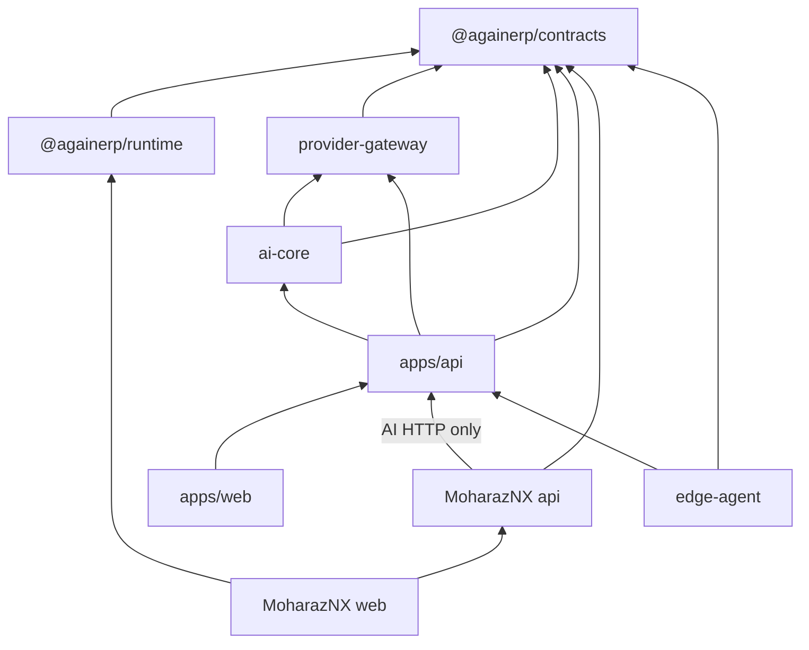

# AgainERP Platform Architecture

> **Constitution:** [AGAINERP_PLATFORM_CONSTITUTION.md](./AGAINERP_PLATFORM_CONSTITUTION.md) — permanent SSOT  
> **Status:** **FROZEN** v1.0.0 (2026-06-30)  
> **Governance:** [PLATFORM_GOVERNANCE_CONFIRMATION.md](./PLATFORM_GOVERNANCE_CONFIRMATION.md)  
> **Rules:** [FROZEN_RULES.md](./FROZEN_RULES.md) — mandatory for all development

---

## Architecture freeze

| Field | Value |
|-------|-------|
| **Architecture Version** | 1.0.0 |
| **Status** | **FROZEN** |
| **Platform Brain** | AgainERP Center |
| **Business ERP Template** | MoharazNX |

Architecture modifications require version bump, executive approval, documentation update, and compatibility validation. Otherwise prohibited.

---

## Mandatory read order

1. [AGAINERP_PLATFORM_CONSTITUTION.md](./AGAINERP_PLATFORM_CONSTITUTION.md)
2. [FROZEN_RULES.md](./FROZEN_RULES.md)
3. [DEVELOPMENT_RULES.md](./DEVELOPMENT_RULES.md)
4. [README.md](../README.md)
5. [MASTER_INDEX.md](../MASTER_INDEX.md)
6. [PROJECT_MAP.md](../PROJECT_MAP.md)
7. [ARCHITECTURE.md](./ARCHITECTURE.md) (this file)
8. [ControlCenter/MASTER_INDEX.md](../ControlCenter/MASTER_INDEX.md)
9. Task-specific documentation

---

## Platform ownership

See [PLATFORM_PACKAGE_OWNERSHIP.md](./PLATFORM_PACKAGE_OWNERSHIP.md). Summary:

- **Center owns:** Platform, AI Core, Runtime SDK, Contracts, Provider Gateway, Plugin/Marketplace, Monitoring, Licensing, Fleet, global config/prompts/policies
- **MoharazNX owns:** Business modules, storefront, business knowledge/prompts/tools, conversation UI, context, local cache

---

## Two repositories (FINAL)

| Repository | Role | Must contain |
|------------|------|--------------|
| **againerp-center** | Platform Brain | All SDKs in `platform/`, operator UI, Platform API, Edge Agent |
| **moharaznx** | Client ERP template | Business modules, storefront, runtime **integration** only |

**Forbidden:** `againerp-platform`, any third platform repository, AI Core or Provider Gateway in MoharazNX.

---

## Platform package tree (normalized)

```
platform/
├── shared-contracts/          @againerp/contracts v1.0.0 ✅
│   ├── dto/
│   ├── events/
│   ├── schemas/
│   ├── interfaces/
│   ├── permissions/
│   ├── types/
│   ├── protocols/
│   └── errors/
├── runtime-sdk/                 @againerp/runtime 🟡
│   ├── conversation/
│   ├── context/
│   ├── prompt-runtime/
│   ├── memory-connector/
│   ├── knowledge-connector/
│   ├── tool-connector/
│   ├── streaming/
│   └── runtime-config/
├── provider-gateway/            Center only 🟡
│   └── providers/
│       ├── openai/
│       ├── claude/
│       ├── gemini/
│       ├── azure/
│       ├── deepseek/
│       ├── ollama/
│       └── openrouter/
├── ai-core/                     Center only 🟡
│   ├── kernel/
│   ├── orchestrator/
│   ├── registry/
│   ├── context/
│   ├── prompt/
│   ├── memory/
│   ├── knowledge/
│   ├── tools/
│   ├── providers/
│   └── security/
├── plugin-sdk/
├── integration-sdk/
├── edge-sdk/
├── monitoring-sdk/
├── licensing-sdk/
├── update-sdk/
└── governance/
```

**Deprecated:** `platform/conversation-sdk/` → merged into `runtime-sdk/conversation/`

---

## Responsibility matrix

| Concern | Center | Runtime SDK | MoharazNX |
|---------|--------|-------------|-----------|
| Provider Gateway | ✅ | ❌ | ❌ |
| AI Core / Orchestrator (platform) | ✅ | ❌ | ❌ |
| Agent Registry (authoritative) | ✅ | cache | enable/disable |
| LLM API keys | ✅ vault | ❌ | ❌ |
| Context / Memory / Tools (tenant) | ❌ | ✅ | configure |
| Business modules | ❌ | ❌ | ✅ |
| Fleet / Licensing / Billing | ✅ | ❌ | ❌ |

---

## Mandatory AI call chain

```
Client UI → @againerp/runtime → Center Provider Gateway → LLM Provider
```

No direct OpenAI, Claude, or Gemini calls from MoharazNX in production.

---

## Architecture audit (summary)

| Dimension | Before normalization | After normalization |
|-----------|---------------------|---------------------|
| Repository count | 2 code + deprecated 3rd (`againerp-platform`) | **2 only** |
| Platform home | Scattered; contracts in 3rd repo | `againerp-center/platform/` |
| `shared-contracts` layout | Flat `src/*.ts` | Normalized `dto/`, `events/`, `types/`, `protocols/`, `errors/`, `permissions/` |
| `conversation-sdk` | Separate scaffold | **Merged** into `runtime-sdk/conversation/` |
| Provider adapters | MoharazNX `llm_client.py` | Scaffolded per-provider folders in Center |
| AI Core | `ai_service.py` monolith | Module tree under `platform/ai-core/` |
| Runtime SDK | MoharazNX `ai/` (181 files, unwired) | Scaffolded; source mapped for Phase 2 `git mv` |
| Duplicated types | MoharazNX `lib/conversation/types.ts` | `@againerp/contracts` (migration pending) |

### Critical boundary violations (unchanged — fix in implementation phases)

| ID | Violation | Location | Target |
|----|-----------|----------|--------|
| B1 | Direct LLM calls | `moharaznx/.../llm_client.py` | `platform/provider-gateway/` |
| B2 | Tenant API keys | `ai_api_connections` | Center vault |
| B3 | Orphaned AI package | `moharaznx/ai/` | `platform/runtime-sdk/` |
| B4 | Broken Center endpoint | `center-client.ts` → 404 | `/agent/v1/conversation` |
| B5 | Duplicate DTOs | `lib/conversation/types.ts` | `@againerp/contracts` |

Full audit: [PLATFORM_ECOSYSTEM_AUDIT.md](./PLATFORM_ECOSYSTEM_AUDIT.md)

---

## Migration summary

| Phase | Deliverable | Status |
|-------|-------------|--------|
| **0** | Platform home + contracts + folder normalization | ✅ **Complete** |
| **1** | Provider Gateway + `/ai/v1/*` | ⬜ Scaffolded |
| **2** | `moharaznx/ai/` → `runtime-sdk/` | ⬜ Mapped |
| **3** | AI Core consolidation | ⬜ Scaffolded |
| **4** | One Chat UI, legacy cleanup | ⬜ Planned |

Detail: [ARCHITECTURE_MIGRATION_REPORT.md](./ARCHITECTURE_MIGRATION_REPORT.md) · [FOLDER_MIGRATION_REPORT.md](./FOLDER_MIGRATION_REPORT.md)

---

## Compatibility report

| Component | Version | Breaking risk | Notes |
|-----------|---------|---------------|-------|
| `@againerp/contracts` | 1.0.0 | **Low** | Subfolder layout; root exports unchanged |
| `@againerp/runtime` | — (planned) | Medium | Rename from `@againerp/ai` 0.6.0 |
| Center API | 2.0.0 | Low | New `/ai/v1/*` routes are additive |
| MoharazNX API | 1.x | Low | Strangler flags during gateway migration |
| Edge Agent | v1 heartbeat | Low | AI queue additive in Phase 2 |

### Compatibility gates (before each release)

- [ ] `CONTRACT_VERSION` semver bump + migration notes if DTOs change
- [ ] MoharazNX smoke: storefront, admin, PC builder
- [ ] Center smoke: fleet, AI access, agent heartbeat
- [ ] No MoharazNX direct LLM when `AI_CENTER_GATEWAY=true`

---

## Dependency report

### Target dependency graph



### Package dependency rules

```
MoharazNX web  → @againerp/runtime → @againerp/contracts
MoharazNX api  → @againerp/contracts → Center HTTP (NOT llm_client)
Center api     → provider-gateway, ai-core → @againerp/contracts
Center web     → apps/api (contracts optional)
Edge agent     → edge-sdk (future) → @againerp/contracts
```

**Forbidden:** MoharazNX → OpenAI/Anthropic/Gemini APIs  
**Forbidden:** MoharazNX → `platform/ai-core`, `platform/provider-gateway`

Detail: [PACKAGE_BOUNDARIES.md](./PACKAGE_BOUNDARIES.md)

---

## Duplication inventory

| Domain | Duplicate locations | Canonical home |
|--------|--------------------|----------------|
| Provider IDs | `llm_client.py`, `ai/constants/providers.ts` | `@againerp/contracts/protocols` |
| Conversation DTOs | `lib/conversation/types.ts` | `@againerp/contracts/dto` |
| Agent manifests | Center `PLATFORM_AGENTS`, MoharazNX `ai_agents`, `ai/registry/` | `platform/ai-core/registry/` |
| Orchestrator | `lib/builder/ai/`, `ai/orchestrator/` | `runtime-sdk` (business) + `ai-core` (platform) |
| HTTP client | Both repos `lib/api/client.ts` | Per-app thin wrappers (acceptable) |
| Design tokens | Both repos `design-system/` | Per-product (low priority) |

---

## Related documents

| Document | Purpose |
|----------|---------|
| [AGAINERP_PLATFORM_CONSTITUTION.md](./AGAINERP_PLATFORM_CONSTITUTION.md) | **Permanent SSOT** |
| [PLATFORM_PACKAGE_OWNERSHIP.md](./PLATFORM_PACKAGE_OWNERSHIP.md) | Package registry |
| [DOCUMENTATION_CONSISTENCY_REPORT.md](./DOCUMENTATION_CONSISTENCY_REPORT.md) | Governance validation |
| [PLATFORM_GOVERNANCE_CONFIRMATION.md](./PLATFORM_GOVERNANCE_CONFIRMATION.md) | Ratification + all confirmations |
| [BRAIN.md](../BRAIN.md) | Developer entry |
| [MASTER_INDEX.md](../MASTER_INDEX.md) | Navigation hub |
| [PROJECT_MAP.md](../PROJECT_MAP.md) | Full repo map |
| [PLATFORM_GUIDE.md](./PLATFORM_GUIDE.md) | Package developer guide |
| [DEVELOPMENT_RULES.md](./DEVELOPMENT_RULES.md) | Mandatory rules |
| [FROZEN_RULES.md](./FROZEN_RULES.md) | **Frozen architecture rules** |
| [ARCHITECTURE_FREEZE_REPORT.md](./ARCHITECTURE_FREEZE_REPORT.md) | Freeze declaration |
| [ARCHITECTURE_VALIDATION_REPORT.md](./ARCHITECTURE_VALIDATION_REPORT.md) | Step B validation |
| [ARCHITECTURE_VERSION.md](./ARCHITECTURE_VERSION.md) | Version registry |
| [REMAINING_TODO.md](./REMAINING_TODO.md) | Implementation debt |
| [ControlCenter/18_Platform_Package_Architecture.md](../ControlCenter/18_Platform_Package_Architecture.md) | Enterprise spec |
| [MIGRATION_CHECKLIST.md](./MIGRATION_CHECKLIST.md) | Implementation phases |

---

*Architecture normalization — Step A complete. Validated and frozen — Step B complete (v1.0.0).*
