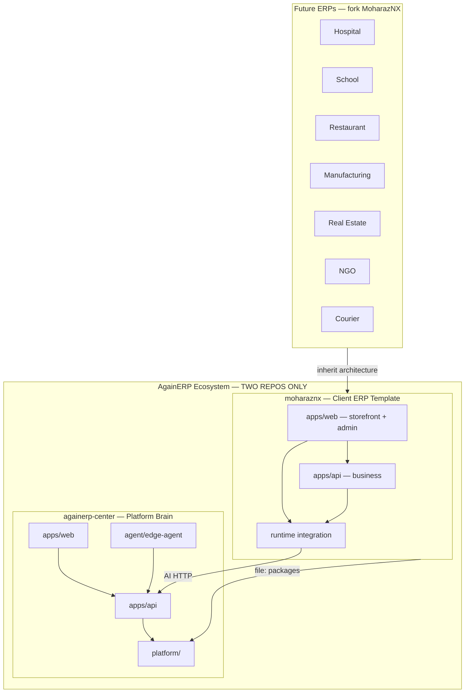
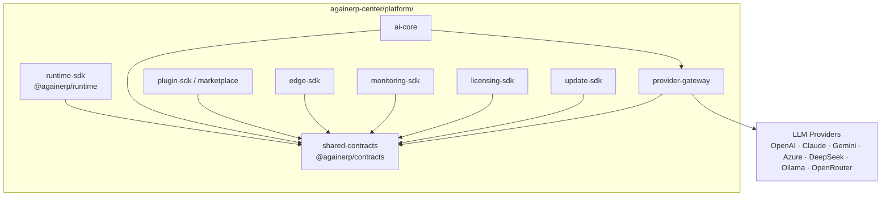
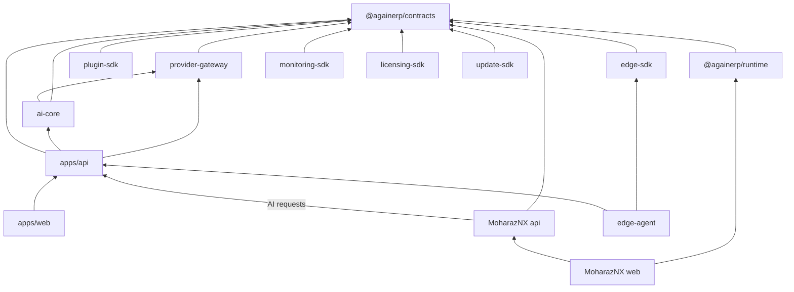

# Architecture Freeze Report

> **Date:** 2026-06-30  
> **Architecture Version:** `1.0.0`  
> **Status:** **FROZEN**  
> **Authority:** Step B — Platform Validation & Freeze  
> **Validation:** [ARCHITECTURE_VALIDATION_REPORT.md](./ARCHITECTURE_VALIDATION_REPORT.md) — PASS WITH CONDITIONS

---

## Freeze declaration

The AgainERP **Platform Architecture v1.0.0** is hereby **frozen**.

From this date forward:

1. **No architecture redesign** without explicit executive approval and version bump.
2. **No new repositories** for platform code.
3. **No duplicate packages** — contracts, runtime, provider gateway, AI Core live only in `againerp-center/platform/`.
4. **Every future feature** must respect [FROZEN_RULES.md](./FROZEN_RULES.md).

Implementation migration (Phases 1–4) continues under the frozen spec — it does not alter the spec.

---

## Architecture version

| Field | Value |
|-------|-------|
| Platform Architecture | **1.0.0** |
| Contract Package | **1.0.0** (`CONTRACT_VERSION`) |
| Freeze date | 2026-06-30 |
| SSOT document | [ARCHITECTURE.md](./ARCHITECTURE.md) |
| Version registry | [ARCHITECTURE_VERSION.md](./ARCHITECTURE_VERSION.md) |

---

## Compatibility matrix (frozen)

| Component | Version | Center | MoharazNX | Future ERP | Breaking change policy |
|-----------|---------|--------|-----------|------------|------------------------|
| Platform Architecture | 1.0.0 | defines | consumes | inherits MoharazNX | Major approval only |
| `@againerp/contracts` | 1.0.0 | defines | must import | must import | Semver + migration guide |
| `@againerp/runtime` | planned 1.0.0 | defines | must import | must import | Shim during transition |
| Provider Gateway | — | runs | never | never | Additive adapters only |
| AI Core | — | runs | never | never | Internal Center module |
| plugin-sdk | — | publishes | loads | loads | Manifest in contracts |
| Edge protocol | v1 | defines | agent only | agent only | Additive messages |
| Center API | 2.0.0 | — | HTTP client | HTTP client | Additive routes preferred |

---

## Repository relationship diagram

---

## Platform diagram

---

## Dependency diagram

**Forbidden edges:** MoharazNX → LLM providers · MoharazNX → `ai-core` · MoharazNX → `provider-gateway`

---

## Frozen rule sets

| Rule set | Document |
|----------|----------|
| Architecture rules | [FROZEN_RULES.md](./FROZEN_RULES.md) § Architecture |
| Developer rules | [DEVELOPMENT_RULES.md](./DEVELOPMENT_RULES.md) |
| Platform rules | [FROZEN_RULES.md](./FROZEN_RULES.md) § Platform |
| Client rules | [FROZEN_RULES.md](./FROZEN_RULES.md) § Client |
| Future development rules | [FROZEN_RULES.md](./FROZEN_RULES.md) § Future |

---

## What changed at freeze

| Step | Deliverable | Status |
|------|-------------|--------|
| A | Folder normalization | ✅ Complete |
| A | `@againerp/contracts` layout | ✅ Complete |
| B | Validation report | ✅ This cycle |
| B | Freeze report | ✅ This document |
| B | Version registry | ✅ ARCHITECTURE_VERSION.md |
| B | Frozen rules | ✅ FROZEN_RULES.md |

---

## Post-freeze development gate

Before shipping any feature:

- [ ] Conforms to Architecture 1.0.0
- [ ] No new platform repository
- [ ] No duplicate contracts/types
- [ ] MoharazNX does not add new provider integrations
- [ ] Contract semver respected if touching DTOs

---

*Architecture Freeze Report — AgainERP Platform v1.0.0 — EFFECTIVE 2026-06-30*
