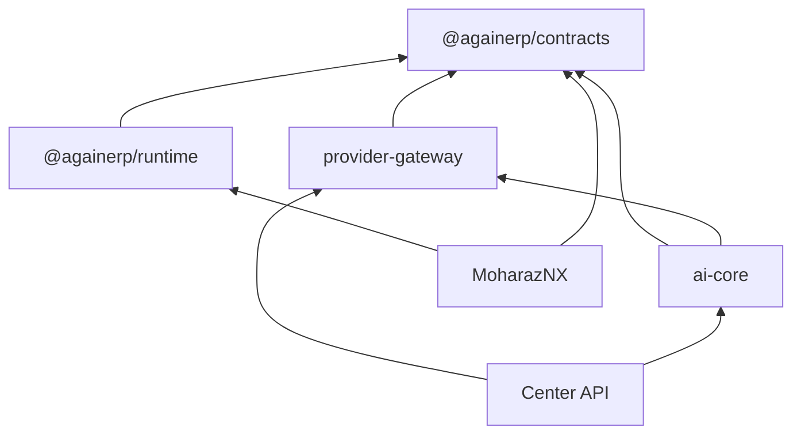

# Architecture Validation Report

> **Date:** 2026-06-30  
> **Step:** B — Platform Validation & Freeze  
> **Validator role:** Chief Enterprise Software Architect  
> **Verdict:** **PASS WITH CONDITIONS** — architecture specification validated and ready to freeze; implementation migration phases 1–4 remain before full runtime compliance

---

## Executive summary

| Area | Result | Notes |
|------|--------|-------|
| Two-repository model | ✅ PASS | Center + MoharazNX only; third repo deprecated |
| Platform folder structure | ✅ PASS | Normalized tree matches Step A specification |
| `@againerp/contracts` | ✅ PASS | Built v1.0.0; no circular imports |
| Platform scaffolds | ✅ PASS | All packages have defined subfolders + READMEs |
| Documentation alignment | 🟡 PASS (minor gaps) | Core docs synced; ControlCenter 14/16 pending |
| MoharazNX boundary compliance | 🔴 FAIL (expected) | Known violations documented; fix in Phases 1–4 |
| Runtime / Gateway / AI Core code | 🟡 SCAFFOLD | Folders exist; source migration not started |
| Future client ERP inheritance | ✅ PASS | Rules codified in DEVELOPMENT_RULES + FROZEN_RULES |

**Recommendation:** Freeze architecture at **v1.0.0**. Development may proceed only along frozen boundaries; implementation debt tracked in [REMAINING_TODO.md](./REMAINING_TODO.md).

---

## 1. AgainERP Center validation

### 1.1 Applications

| Component | Path | Validated | Finding |
|-----------|------|-----------|---------|
| Operator UI | `apps/web/` | ✅ | Next.js 16, root routes, no `/center` prefix |
| Platform API | `apps/api/` | ✅ | FastAPI, 22 routers, metadata-only models |
| Edge Agent | `agent/edge-agent/` | ✅ | Heartbeat protocol; maps to `edge-sdk` Phase 2 |

### 1.2 Platform packages

| Package | Folder exists | Subfolders | Built package | Source code |
|---------|---------------|------------|---------------|-------------|
| shared-contracts | ✅ | ✅ dto, events, types, protocols, errors, permissions, interfaces, schemas | ✅ `@againerp/contracts` v1.0.0 | ✅ |
| runtime-sdk | ✅ | ✅ 8 modules | ❌ no package.json | ⬜ scaffold (.gitkeep) |
| provider-gateway | ✅ | ✅ 7 providers | ❌ | ⬜ scaffold |
| ai-core | ✅ | ✅ 9 modules | ❌ | ⬜ scaffold; logic in `apps/api/app/services/ai_service.py` |
| plugin-sdk | ✅ | — | ❌ | ⬜ scaffold |
| edge-sdk | ✅ | — | ❌ | ⬜ scaffold |
| monitoring-sdk | ✅ | — | ❌ | ⬜ scaffold |
| licensing-sdk | ✅ | — | ❌ | ⬜ scaffold |
| update-sdk | ✅ | — | ❌ | ⬜ scaffold |
| conversation-sdk | deprecated | — | — | ✅ merged into runtime-sdk/conversation |

### 1.3 Marketplace

No standalone `marketplace/` package. **Validated mapping:** Plugin marketplace → `platform/plugin-sdk/` + Center module registry (`apps/api` modules router). Documented in ControlCenter Step 08 + audit. ✅ Acceptable per frozen architecture.

---

## 2. MoharazNX validation

### 2.1 Business layer (in scope)

| Area | Path | Validated |
|------|------|-----------|
| Storefront | `apps/web/src/app/(storefront)/` | ✅ 39 routes |
| Business modules | `apps/api/app/routers/` | ✅ 47+ routers (catalog, orders, inventory, SEO, …) |
| Admin frontend | `apps/web/src/app/` (non-storefront) | ✅ |
| Backend | `apps/api/` | ✅ FastAPI monolith |

### 2.2 Runtime integration (target vs actual)

| Check | Expected | Actual | Status |
|-------|----------|--------|--------|
| Imports `@againerp/contracts` | Yes | No `package.json` link | 🔴 |
| Imports `@againerp/runtime` | Yes | No link; uses local `@againerp/ai` | 🔴 |
| Never imports Provider Gateway | Yes | N/A (not in Center yet) | 🟡 |
| Never owns AI Core | Yes | `ai/` has orchestrator/registry (pre-migration) | 🔴 |
| Center bridge | `center-client.ts` | Exists; uses local `types.ts` not contracts | 🟡 |
| Direct LLM calls | Forbidden | `llm_client.py` active | 🔴 |
| OpenAI SDK in web | Forbidden in prod | `openai` in `apps/web/package.json` | 🔴 |

### 2.3 Context, knowledge, tools, chat

| Surface | Location | Boundary |
|---------|----------|----------|
| Chat / AI consultant | `(storefront)/ai-consultant/` | Business UI — must route via runtime → Center |
| PC builder AI | `builder/pc-builder/`, BFF routes | Business UI + local orchestrator — migrate Phase 2 |
| Conversation lib | `lib/conversation/` | Integration layer — types duplicate contracts |
| Builder AI | `lib/builder/ai/` | Business tools — provider calls violate boundary |

---

## 3. Structural checks

### 3.1 Folder structure

```
✅ platform/shared-contracts/ — normalized subfolders
✅ platform/runtime-sdk/ — 8 module folders
✅ platform/provider-gateway/providers/ — 7 provider folders
✅ platform/ai-core/ — 9 module folders
✅ Satellite SDKs scaffolded
✅ conversation-sdk deprecated
```

### 3.2 Dependencies (target graph)



**Circular dependencies in `@againerp/contracts`:** None detected.

```
types/ids
  → dto/, protocols/, events/, errors/
  → interfaces/ (re-exports only)
```

### 3.3 Shared types duplication

| Type domain | Canonical | Duplicate | Action |
|-------------|-----------|-----------|--------|
| Conversation DTOs | `@againerp/contracts/dto` | `moharaznx/.../conversation/types.ts` | Phase 0 TODO |
| Provider IDs | `@againerp/contracts/protocols` | `ai/constants/providers.ts`, `llm_client.py` | Phase 1–2 |
| Agent manifest | `@againerp/contracts/dto/agents` | `ai/registry/`, Center `PLATFORM_AGENTS` | Phase 3 |

### 3.4 Import paths

| Consumer | Expected imports | Actual |
|----------|------------------|--------|
| Center web | `@againerp/contracts` (future) | Not linked |
| Center api | contracts schemas / pydantic gen | Not linked |
| MoharazNX web | `@againerp/runtime`, `@againerp/contracts` | `@/` local paths only |
| MoharazNX ai | Should not exist post-Phase 2 | `@againerp/ai` local package |

### 3.5 Architecture boundaries

| Boundary | Spec | Compliance |
|----------|------|------------|
| AI Core only in Center | `platform/ai-core/` | 🟡 Spec yes; code in `ai_service.py` until Phase 3 |
| Runtime only in Center | `platform/runtime-sdk/` | 🔴 Source still in `moharaznx/ai/` |
| Contracts only in Center | `platform/shared-contracts/` | ✅ |
| Provider Gateway only in Center | `platform/provider-gateway/` | ✅ (MoharazNX `llm_client.py` is violation) |
| Metadata only in Center DB | Documented | ✅ |
| Business data only in MoharazNX | Documented | ✅ |

### 3.6 Naming standards

| Item | Convention | Validated |
|------|------------|-----------|
| Platform packages | kebab-case folders | ✅ |
| npm contracts | `@againerp/contracts` | ✅ |
| npm runtime (planned) | `@againerp/runtime` | ✅ documented |
| Center UI components | `center-*` prefix | ✅ |
| API routes | `/api/v1/*`, `/agent/v1/*` | ✅ |

---

## 4. Documentation validation

| Document | Matches reality | Notes |
|----------|-----------------|-------|
| `PROJECT_MAP.md` | ✅ | Platform tree accurate |
| `MASTER_INDEX.md` | ✅ | Package statuses accurate |
| `BRAIN.md` | ✅ | Points to ARCHITECTURE.md |
| `docs/ARCHITECTURE.md` | ✅ | SSOT aligned |
| `docs/PLATFORM_GUIDE.md` | ✅ | Package guide accurate |
| `docs/DEVELOPMENT_RULES.md` | ✅ | Two-repo rules |
| `docs/PACKAGE_BOUNDARIES.md` | ✅ | Matrix accurate |
| `docs/MIGRATION_CHECKLIST.md` | ✅ | Phases honest |
| `platform/README.md` | ✅ | |
| `ControlCenter/18_Platform_Package_Architecture.md` | ✅ | v2.0 normalized |
| `ControlCenter/14_AI_Control.md` | 🟡 | Pre-gateway wording |
| `ControlCenter/16_Project_Structure.md` | 🟡 | Legacy `control/` placement |
| MoharazNX `PLATFORM_SPLIT.md` | ✅ | Updated Step A |
| MoharazNX `BRAIN.md` | ✅ | Updated |
| MoharazNX `PROJECT_MAP.md` | ✅ | Migration notes accurate |

---

## 5. Future client ERP validation

Per [DEVELOPMENT_RULES.md](./DEVELOPMENT_RULES.md), these products **must fork MoharazNX**, not Center:

| Template | Inherits from MoharazNX | Platform packages |
|----------|-------------------------|-------------------|
| Hospital ERP | ✅ | `@againerp/contracts`, `@againerp/runtime` |
| School ERP | ✅ | same |
| Restaurant ERP | ✅ | same |
| Manufacturing ERP | ✅ | same |
| Real Estate ERP | ✅ | same |
| NGO ERP | ✅ | same |
| Courier ERP | ✅ | same |

**Rule validated:** No per-client platform redesign. Business modules only; platform via Center packages.

---

## 6. Validation checklist (Step B)

| # | Check | Result |
|---|-------|--------|
| 1 | AI Core exists ONLY in Center (spec) | ✅ |
| 2 | Runtime SDK exists ONLY in Center (spec) | ✅ |
| 3 | Shared Contracts exist ONLY in Center | ✅ |
| 4 | Provider Gateway exists ONLY in Center (spec) | ✅ |
| 5 | MoharazNX imports Runtime (target) | 🔴 Not yet |
| 6 | MoharazNX imports Contracts (target) | 🔴 Not yet |
| 7 | MoharazNX never imports Providers | 🟡 No import; `llm_client.py` violates spirit |
| 8 | MoharazNX never owns AI Core (target) | 🔴 Pre-migration `ai/` |
| 9 | No circular contract dependencies | ✅ |
| 10 | Folder structure matches docs | ✅ |
| 11 | No third platform repository | ✅ |
| 12 | Future ERP inheritance documented | ✅ |

---

## 7. Verdict

**Architecture specification: VALIDATED — ready to freeze at v1.0.0.**

**Implementation compliance: INCOMPLETE — 12 tracked items in [REMAINING_TODO.md](./REMAINING_TODO.md) must complete before claiming full boundary compliance.**

Development may begin **only** if all new work follows [FROZEN_RULES.md](./FROZEN_RULES.md). Existing MoharazNX violations are grandfathered until their migration phase executes — no expansion of violations permitted.

---

*End of Architecture Validation Report — Step B*
