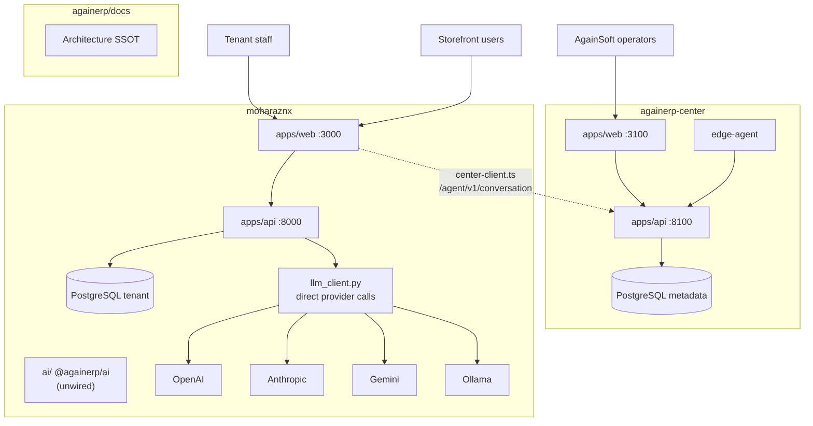
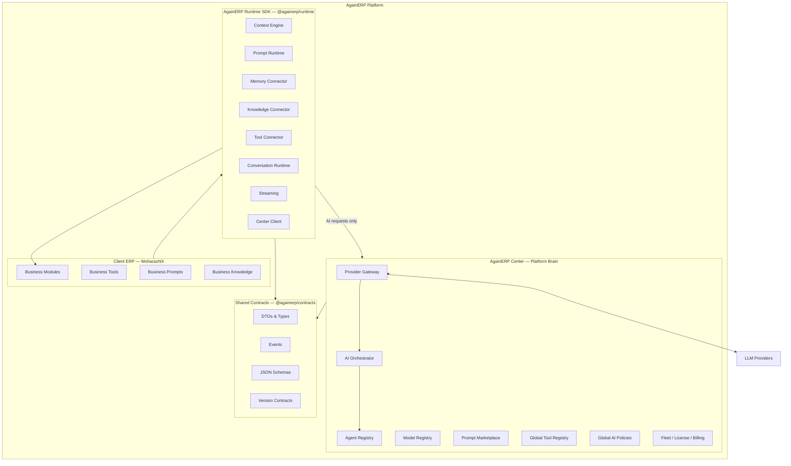
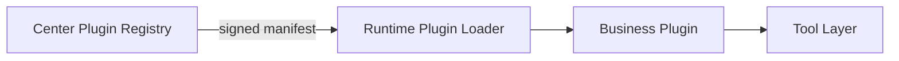
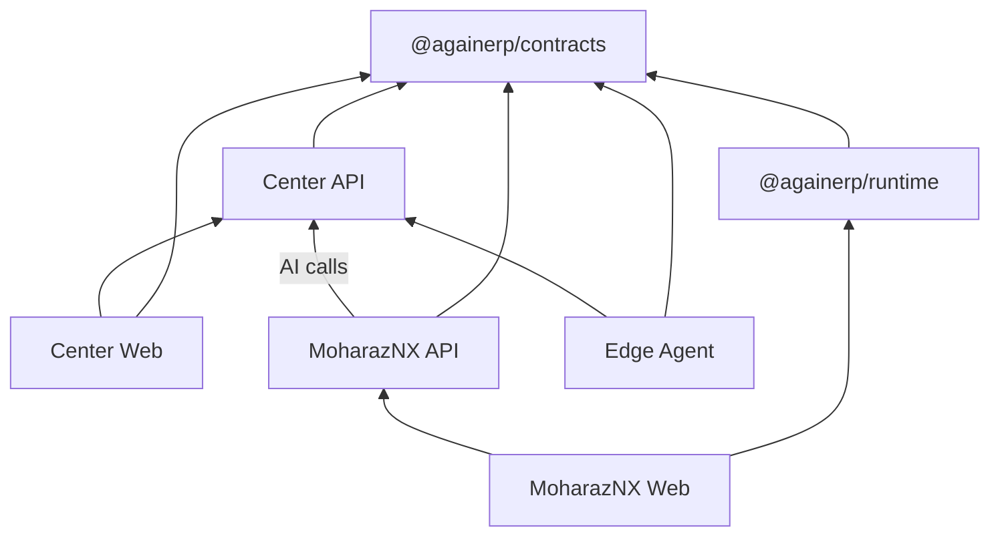
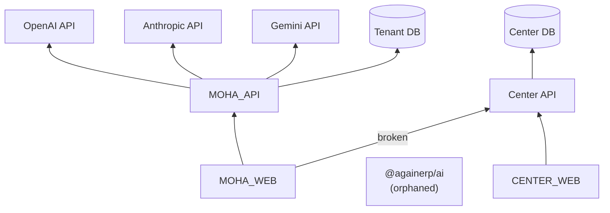

# AgainERP Platform — Architecture Audit Report

> **Audit date:** 2026-06-30  
> **Scope:** Ecosystem-wide — `againerp-center` + `moharaznx`  
> **Update 2026-06-30:** **Two-repository decision** — platform packages merge into `againerp-center/platform/`. The `againerp-platform` third repo is deprecated. **Step A normalization complete** — see [ARCHITECTURE.md](./ARCHITECTURE.md).

> **Role:** Chief Platform Architect — analysis and refactor plan  
> **Authority:** Supersedes single-repo [AUDIT_REPORT.md](./AUDIT_REPORT.md) for platform architecture decisions

---

## Executive Summary

AgainERP is **architecturally documented as one AI-first platform** but **implemented as two independent repositories** with duplicated AI logic, missing shared contracts, and critical boundary violations — most notably **MoharazNX calling LLM providers directly** while **Center lacks the AI Core it is supposed to own**.

The `@againerp/ai` package (181 TypeScript modules in MoharazNX) is a strong foundation for a **Runtime SDK** but is **not wired to production paths**; meanwhile `apps/api/app/services/llm_client.py` bypasses the entire AI OS design.

| Dimension | Current state | Target state |
|-----------|---------------|--------------|
| Platform brain (AI Core) | Split / missing in Center | Consolidated in Center |
| Client runtime | Ad-hoc Python + web orchestrators | `@againerp/runtime` SDK |
| Shared contracts | None — duplicated types | `@againerp/contracts` |
| Provider access | MoharazNX → OpenAI/Anthropic/Gemini directly | Client → Runtime → Center Gateway → Provider |
| Agent registry | 3 parallel definitions | Center authoritative; client read-only cache |
| Scale readiness | Per-repo patterns; no version contracts | Contract-versioned; 1000+ ERP products |

**Recommendation:** Execute a **phased strangler migration** — introduce shared contracts and runtime SDK first, add Center Provider Gateway behind existing MoharazNX API shapes, then relocate AI Core without breaking storefront or admin flows.

---

## Table of Contents

1. [Current Architecture](#1-current-architecture)
2. [Strengths](#2-strengths)
3. [Weaknesses](#3-weaknesses)
4. [Duplicated Logic](#4-duplicated-logic)
5. [Boundary Violations](#5-boundary-violations)
6. [Missing Layers & Packages](#6-missing-layers--packages)
7. [Future Risks](#7-future-risks)
8. [Target Platform Architecture](#8-target-platform-architecture)
9. [Refactoring Plan](#9-refactoring-plan)
10. [Migration Plan](#10-migration-plan)
11. [Repository Refactoring Plan](#11-repository-refactoring-plan)
12. [Folder Refactoring Plan](#12-folder-refactoring-plan)
13. [Shared Package Plan](#13-shared-package-plan)
14. [Runtime SDK Plan](#14-runtime-sdk-plan)
15. [Provider Gateway Plan](#15-provider-gateway-plan)
16. [Plugin System Plan](#16-plugin-system-plan)
17. [Compatibility Matrix](#17-compatibility-matrix)
18. [Implementation Order](#18-implementation-order)
19. [Risk Analysis](#19-risk-analysis)
20. [Dependency Graph](#20-dependency-graph)
21. [Documentation Updates Required](#21-documentation-updates-required)

---

## 1. Current Architecture

### 1.1 Ecosystem topology (as deployed today)



### 1.2 Repository A — AgainERP Center

| Layer | Location | Responsibility today |
|-------|----------|---------------------|
| Operator UI | `apps/web/` | Fleet, billing, licenses, AI access **metadata**, monitoring |
| Platform API | `apps/api/` | 22 routers, 13 services, 23 ORM models — metadata only |
| Edge Agent | `agent/edge-agent/` | Heartbeat, PageSpeed audit |
| Architecture docs | `ControlCenter/` | Steps 01–17 + UI specs |
| AI today | `apps/api/app/services/ai_service.py` | **Provisioning metadata** — credits, fleet AI access, Chief briefing **templates** (not LLM orchestration) |

**Center does NOT yet implement:** AI Orchestrator, Provider Gateway, Model Registry, Prompt Marketplace, conversation runtime, `/agent/v1/conversation`.

### 1.3 Repository B — MoharazNX

| Layer | Location | Responsibility today |
|-------|----------|---------------------|
| Admin + Storefront UI | `apps/web/` | Full ecommerce ERP + multiple AI surfaces |
| Tenant API | `apps/api/` | 47 routers, business CRUD + **direct LLM** |
| AI OS package | `ai/` (`@againerp/ai` v0.6.0) | Orchestrator, registry, context, prompt, memory — **foundation only, not imported by apps** |
| AI runtime (de facto) | `llm_client.py`, `pc_builder_llm.py`, `lib/builder/ai/` | Production AI paths |
| Center bridge | `lib/conversation/center-client.ts` | Calls **non-existent** Center endpoint |

### 1.4 Documented vs implemented AI flow

**Documented (AI_OS_ARCHITECTURE.md):**

```
User → Again AI Assistant → AI Gateway → Orchestrator → Agents → Tools → ERP
                                              ↓
                                    Provider Gateway (Center)
```

**Implemented (MoharazNX storefront chat):**

```
User → Chat Widget → FastAPI → llm_client.py → OpenAI API (direct)
```

**Implemented (PC Builder):**

```
User → Next.js BFF route → [center-client OR FastAPI llm] → OpenAI
                      → lib/builder/ai/agents/orchestrator.ts (local multi-agent)
```

### 1.5 Data boundaries (correct)

| Store | Location | Contents |
|-------|----------|----------|
| Platform metadata | Center PostgreSQL | clients, licenses, heartbeats, billing refs, AI credits |
| Tenant business | MoharazNX PostgreSQL | products, orders, customers, inventory, ai_audit_logs |

This boundary is **correct and must be preserved**.

---

## 2. Strengths

| # | Strength | Evidence |
|---|----------|----------|
| S1 | **Clear platform vs tenant split (documented)** | `PLATFORM_SPLIT.md`, `BRAIN.md` in both repos |
| S2 | **Comprehensive AI OS SSOT** | `moharaznx/docs/AI_OS_ARCHITECTURE.md` — 1100 lines, principles P1–P12 |
| S3 | **`@againerp/ai` foundation package** | 181 files — orchestrator, registry, context, prompt, memory with bridge pattern |
| S4 | **Center metadata-only enforcement** | No business tables in Center; Edge Agent heartbeat only |
| S5 | **Modular FastAPI monoliths** | Thin routers, service layer, seed/bootstrap patterns in both repos |
| S6 | **Adapter layer in Center web** | `lib/adapters/*` decouples UI from API evolution |
| S7 | **Lean implementation discipline (MoharazNX)** | ROADMAP steps 0–39; repeatable domain pattern |
| S8 | **OpenAPI export path (Center)** | `docs/api/openapi/control-center.openapi.json` |
| S9 | **Provider constants defined in AI package** | OpenAI, Anthropic, Gemini, Azure, Ollama in `ai/constants/providers.ts` |
| S10 | **Edge Agent protocol started** | `/agent/v1/heartbeat` working; mTLS planned |

---

## 3. Weaknesses

| # | Weakness | Impact |
|---|----------|--------|
| W1 | **AI Core lives in client ERP** | Security, billing, provider keys exposed on tenant infra |
| W2 | **`@againerp/ai` not wired to runtime** | 6 months of architecture work unused in production |
| W3 | **No shared contracts package** | Type drift between Python schemas and TS interfaces |
| W4 | **Missing Center conversation API** | `center-client.ts` → `/agent/v1/conversation` returns 404 |
| W5 | **Multiple AI chat UIs** | Violates "One Chat" — consultant, PC builder, support chat separate |
| W6 | **Parallel agent registries** | Center `PLATFORM_AGENTS`, MoharazNX `ai_agents` table, `@againerp/ai/registry` |
| W7 | **No Turborepo / workspace** | Cannot share packages cleanly across repos |
| W8 | **Redis provisioned but unused (Center)** | False sense of event-driven readiness |
| W9 | **Legacy duplication** | `control/` mirror, MoharazNX `/center` routes, mock-data types as SSOT |
| W10 | **No contract versioning** | Breaking API changes risk silent client breakage |
| W11 | **Provider logic in Python only (client)** | TypeScript AI package providers layer empty |
| W12 | **BRAIN.md stale (MoharazNX)** | Says "Phase 1 UI only, no API" — contradicts live FastAPI stack |

---

## 4. Duplicated Logic

| Domain | Center | MoharazNX | `@againerp/ai` | Resolution |
|--------|--------|-----------|----------------|------------|
| **HTTP client** | `lib/api/client.ts` | `lib/api/client.ts` | — | Extract to `@againerp/contracts` transport helpers or keep per-app thin wrappers |
| **Provider IDs** | — | `llm_client.py` (openai/anthropic/google/local) | `constants/providers.ts` | Single source: `@againerp/contracts/providers` |
| **Agent definitions** | `ai_service.PLATFORM_AGENTS` | `ai_agents` ORM + seeds | `registry/manifest/defaults.ts` | Center owns platform agents; tenant agents = business layer config referencing Center catalog |
| **AI access / credits** | `client_ai_access` model | `ai_providers`, `ai_api_connections` | `config/types.ts` | Center meters; client stores connection **refs** only |
| **Audit logging** | `audit_log` (operators) | `ai_audit_logs` (tenant AI) | `security/audit/` | Unified event schema in contracts; separate stores |
| **Orchestrator** | — (missing) | `lib/builder/ai/agents/orchestrator.ts` | `orchestrator/` | Move business orchestration to Runtime SDK; platform orchestration to Center |
| **Prompt composition** | — | `lib/builder/ai/prompt-hierarchy.ts` | `prompt/composer/` | Runtime SDK prompt layer |
| **OpenAPI / API types** | Pydantic models | Pydantic + TS interfaces | TS interfaces only | Generate TS from OpenAPI OR shared JSON Schema in contracts |
| **Navigation / shell** | `center-shell`, sidebar | Admin layout | — | Intentionally separate (different products) |
| **Design tokens** | `design-system/` | `design-system/` | — | Future: `@againerp/design-tokens` (low priority) |

---

## 5. Boundary Violations

| # | Violation | Severity | Location |
|---|-----------|----------|----------|
| B1 | **Client calls LLM providers directly** | 🔴 Critical | `moharaznx/apps/api/app/services/llm_client.py` |
| B2 | **API keys stored on tenant** | 🔴 Critical | `ai_api_connections.api_key`, `OPENAI_API_KEY` env |
| B3 | **AI Orchestrator in client web** | 🟠 High | `apps/web/src/lib/builder/ai/agents/orchestrator.ts` |
| B4 | **Platform agent registry in tenant DB** | 🟠 High | `ai_providers`, `ai_agents` tables — overlap with Center AI governance |
| B5 | **Center endpoint assumed but missing** | 🟠 High | `center-client.ts` → `/agent/v1/conversation` |
| B6 | **MoharazNX hosts legacy Center UI** | 🟡 Medium | `apps/web/src/app/center/` (deprecated) |
| B7 | **Duplicate ControlCenter docs** | 🟡 Medium | `againerp-center/control/` mirror |
| B8 | **"ERP Center" naming collision** | 🟡 Medium | MoharazNX `/ai-os` vs platform Center |
| B9 | **Next.js BFF calls backend then OpenAI** | 🟠 High | `apps/web/src/app/api/v1/ai/pc-builder/route.ts` |
| B10 | **Global prompts in client code** | 🟡 Medium | `build_system_prompt()`, hardcoded agent prompts in builder |

### Correct boundaries (preserve)

```
✅ Center stores client metadata, not orders/products
✅ MoharazNX stores tenant business data
✅ Edge Agent reports health, not business rows
✅ PLATFORM_SPLIT.md bridge files (center-client.ts, againerp-center-link.tsx)
```

---

## 6. Missing Layers & Packages

### 6.1 Missing shared packages

| Package | Purpose | Status |
|---------|---------|--------|
| `@againerp/contracts` | DTOs, events, errors, API version contracts | ❌ Missing |
| `@againerp/runtime` | Client-side AI runtime SDK | ❌ Missing (partial: `@againerp/ai`) |
| `@againerp/agent-protocol` | Edge agent message schemas | ❌ Planned in docs only |
| `@againerp/provider-gateway` (internal) | Center provider abstraction | ❌ Missing |

### 6.2 Missing runtime layer (client)

Per target architecture, client needs:

| Component | Expected | Current |
|-----------|----------|---------|
| Context Engine | `@againerp/runtime/context` | `@againerp/ai/context` exists but unwired |
| Prompt Runtime | Business prompt layer only | Hardcoded in builder + llm_client |
| Memory Connector | Tenant-scoped memory | `@againerp/ai/memory` exists but unwired |
| Knowledge Connector | RAG to tenant docs | Not implemented |
| Tool Connector | ERP tool calls | Partial in chat_order_service only |
| Streaming | SSE/WebSocket to UI | Partial in PC builder BFF |
| Conversation Runtime | Single thread manager | Multiple separate stores |
| Local Cache | Prompt/agent manifest cache | None |
| Center Client | Signed requests to Platform Brain | `center-client.ts` (broken endpoint) |

### 6.3 Missing provider layer (Center)

| Component | Expected | Current |
|-----------|----------|---------|
| Provider Gateway | Unified LLM routing | ❌ |
| Model Registry | Model catalog per provider | ❌ |
| API key vault | Platform-held secrets | ❌ (keys on tenant) |
| Failover / routing rules | Per plan, per intent | ❌ |
| Token metering | Credit deduction per call | Partial metadata in `client_ai_access` |
| Safety Guard | Prompt injection, PII scrub | Stubs in `@againerp/ai/security` only |

### 6.4 Missing contracts

| Contract | Needed by | Status |
|----------|-----------|--------|
| `ConversationRequest` / `ConversationResponse` | Runtime ↔ Center | TS types in MoharazNX only; no Center endpoint |
| `AgentManifest` | Registry sync | 3 incompatible shapes |
| `ProviderConfig` | Gateway ↔ Runtime | Split across Python + TS |
| `AiUsageEvent` | Billing | Not standardized |
| `HeartbeatPayload` | Edge Agent | Implemented in Center only |
| `PlatformEvent` v1 | Event bus | Not defined |
| Version header `X-Contract-Version` | All cross-repo APIs | Not used |

---

## 7. Future Risks

| Risk | Trigger | Consequence |
|------|---------|-------------|
| **N× provider integrations** | Each new ERP product copies `llm_client.py` | Unmaintainable; inconsistent security |
| **API key leakage** | Tenant DB breach | All LLM spend compromised |
| **Type drift** | Center API change without TS update | Silent runtime failures |
| **AI feature fragmentation** | New module adds own chat | Violates SSOT; UX breaks |
| **Center becomes monolith** | Moving all AI into `ai_service.py` | Unscalable; blocks multi-region |
| **Runtime SDK fork** | Hospital ERP copies `@againerp/ai` | Divergent orchestrators |
| **Breaking MoharazNX during migration** | Big-bang provider move | Storefront AI downtime |
| **Contract version chaos** | No semver on shared packages | 1000 clients on incompatible contracts |
| **Duplicate billing** | Credits in Center + connections in tenant | Double-charge or bypass |
| **OpenAI SDK in frontend** | Developer convenience | Key exposure (listed in web package.json deps) |

---

## 8. Target Platform Architecture



### Responsibility matrix (target)

| Concern | Center | Runtime SDK | Client ERP |
|---------|--------|-------------|------------|
| AI Orchestrator (platform) | ✅ | ❌ | ❌ |
| AI Orchestrator (business routing) | ❌ | ✅ | ❌ |
| Provider Gateway | ✅ | ❌ | ❌ |
| LLM API keys | ✅ | ❌ | ❌ |
| Agent Registry (authoritative) | ✅ | cache | enable/disable |
| Prompt Marketplace (global) | ✅ | — | — |
| Business prompts | ❌ | merge layer | configure |
| Memory (tenant) | ❌ | ✅ | — |
| Knowledge (tenant) | ❌ | ✅ | upload |
| Business tools | ❌ | ✅ | implement |
| Products/Orders | ❌ | ❌ | ✅ |
| Fleet/Licensing | ✅ | ❌ | ❌ |

### AI call chain (mandatory)

```
Client UI
  → @againerp/runtime (Conversation Runtime)
    → Center Provider Gateway (/ai/v1/complete | /ai/v1/stream)
      → LLM Provider
```

**No other path permitted in production.**

---

## 9. Refactoring Plan

### Phase 0 — Foundation (no behavior change)

1. Create `@againerp/contracts` monorepo package (or standalone repo)
2. Extract existing types from `center-client.ts`, `ai/interfaces/*`, Center OpenAPI
3. Add contract version header to all cross-repo calls
4. Document target architecture in both `MASTER_INDEX.md` files
5. Mark boundary violations with `@deprecated` comments (no removal yet)

### Phase 1 — Provider Gateway (strangler)

1. Implement Center `Provider Gateway` service behind `/ai/v1/*`
2. Add `/agent/v1/conversation` matching existing `CenterAiRequest/Response`
3. MoharazNX `llm_client.py` → thin wrapper calling Center gateway (fallback to direct for dev flag)
4. Move API keys to Center `platform_settings` / vault; tenant stores connection **ID refs** only

### Phase 2 — Runtime SDK extraction

1. Rename/restructure `@againerp/ai` → `@againerp/runtime`
2. Wire storefront chat through runtime orchestrator (not raw llm_client)
3. Consolidate PC builder orchestrator into runtime pipeline
4. Implement Center Client module with retry, offline queue via Edge Agent

### Phase 3 — Platform Brain consolidation

1. Move platform agent registry to Center DB; MoharazNX syncs read-only manifest
2. Implement Model Registry, Prompt Marketplace (MVP: global templates)
3. Chief AI + specialist agents call Provider Gateway internally
4. Unified AI usage metering → billing

### Phase 4 — One Chat + Plugin system

1. Single `AgainAiAssistant` component; all buttons inject context
2. Plugin registry API in Center; runtime loads business plugins
3. Deprecate separate chat widgets

### Phase 5 — Multi-ERP readiness

1. Publish `@againerp/runtime` + `@againerp/contracts` to private npm
2. Hospital/School ERP templates inherit runtime; zero AI architecture design
3. Contract compatibility CI across repos

---

## 10. Migration Plan

### 10.1 Strangler fig pattern

Keep MoharazNX API shapes stable; swap implementation behind services:

```
storefront/chat  →  chat_service  →  [FLAG] runtime  →  center_gateway
                                    →  [LEGACY] llm_client (dev only)
```

### 10.2 Feature flags

| Flag | Default | Purpose |
|------|---------|---------|
| `AI_RUNTIME_ENABLED` | `false` → `true` | Use `@againerp/runtime` pipeline |
| `AI_CENTER_GATEWAY` | `false` → `true` | Route LLM via Center |
| `AI_DIRECT_PROVIDER_FALLBACK` | `true` → `false` | Local dev only |
| `AI_ONE_CHAT` | `false` | Single assistant UI |

### 10.3 Data migration

| Data | Action |
|------|--------|
| `ai_api_connections.api_key` | Rotate keys; store in Center vault; tenant keeps `connection_ref_id` |
| `ai_agents` tenant rows | Map to Center catalog IDs; tenant stores overrides only |
| `ai_providers` | Platform catalog in Center; tenant enables subset |
| `client_ai_access` (Center) | Becomes billing source of truth |

### 10.4 Rollback strategy

Each phase deploys gateway with **dual-write audit** (log both paths, serve one). Rollback = flip flag.

---

## 11. Repository Refactoring Plan

### 11.1 New repository (recommended): `againerp-platform`

```
againerp-platform/          # NEW — shared packages monorepo
├── packages/
│   ├── contracts/          # @againerp/contracts
│   ├── runtime/            # @againerp/runtime (from moharaznx/ai)
│   └── agent-protocol/     # @againerp/agent-protocol
├── pnpm-workspace.yaml
└── turbo.json
```

**Alternative:** Git submodule / npm publish from MoharazNX `ai/` — less clean for 1000+ products.

### 11.2 `againerp-center` changes

| Action | Detail |
|--------|--------|
| Add | `apps/api/app/services/provider_gateway/` |
| Add | `apps/api/app/services/ai_orchestrator/` |
| Add | `apps/api/app/routers/ai_runtime.py` (`/ai/v1/*`) |
| Add | `apps/api/app/routers/agent_conversation.py` |
| Extend | `ai_service.py` → split provisioning vs orchestration |
| Add | Dependency on `@againerp/contracts` (Python: generate from JSON Schema) |
| Remove (later) | Duplicate `control/` folder |
| Keep | `apps/web`, `agent/edge-agent`, `ControlCenter/` docs |

### 11.3 `moharaznx` changes

| Action | Detail |
|--------|--------|
| Move | `ai/` → consume from `@againerp/runtime` npm package |
| Refactor | `llm_client.py` → `center_gateway_client.py` |
| Deprecate | Direct provider functions (keep dev fallback) |
| Consolidate | AI chat UIs → single assistant |
| Remove (later) | `apps/web/src/app/center/` legacy routes |
| Remove (later) | `control/` legacy docs |
| Keep | All business modules unchanged |
| Update | `BRAIN.md`, `PROJECT_MAP.md` to reflect live API stack |

---

## 12. Folder Refactoring Plan

### 12.1 Center — target tree (additions only)

```
apps/api/app/
├── ai/                           # NEW — Platform Brain
│   ├── orchestrator/
│   ├── provider_gateway/
│   │   ├── adapters/
│   │   │   ├── openai.py
│   │   │   ├── anthropic.py
│   │   │   ├── gemini.py
│   │   │   ├── azure_openai.py
│   │   │   ├── openrouter.py
│   │   │   ├── deepseek.py
│   │   │   └── ollama.py
│   │   ├── router.py             # model selection, failover
│   │   └── metering.py
│   ├── registry/                 # authoritative agent + model registry
│   ├── prompts/                  # global prompt marketplace
│   └── policies/                 # safety, PII, rate limits
├── routers/
│   ├── ai_runtime.py             # /ai/v1/* — client runtime API
│   └── agent_conversation.py     # /agent/v1/conversation
```

### 12.2 Runtime SDK — target tree (from `@againerp/ai`)

```
packages/runtime/
├── src/
│   ├── center-client/            # from moharaznx center-client.ts
│   ├── conversation/             # thread manager, streaming
│   ├── context/                  # from ai/context
│   ├── prompt/                   # business prompt layer only
│   ├── memory/                   # from ai/memory
│   ├── knowledge/                # tenant RAG connector
│   ├── tools/                    # tool connector interface
│   ├── orchestrator/             # business routing (NOT provider calls)
│   ├── cache/                    # local manifest cache
│   ├── events/                   # from ai/orchestrator/events
│   └── adapters/                 # Next.js, FastAPI bindings
```

### 12.3 MoharazNX — target tree (AI cleanup)

```
apps/api/app/services/
├── ai_gateway_service.py         # NEW — calls Center /ai/v1
├── chat_service.py               # REFACTOR — uses ai_gateway_service
└── llm_client.py                 # DEPRECATED — dev fallback only

apps/web/src/
├── components/ai-assistant/      # NEW — single Again AI component
├── lib/runtime/                  # NEW — @againerp/runtime re-exports
└── lib/builder/ai/               # SHRINK — business tools only, no provider calls
```

---

## 13. Shared Package Plan

### `@againerp/contracts`

| Module | Contents |
|--------|----------|
| `providers` | ProviderID enum, model IDs |
| `agents` | AgentManifest, AgentStatus |
| `conversation` | ConversationRequest, ConversationResponse, StreamChunk |
| `context` | ContextStack, PageContext, BusinessContext |
| `events` | AiUsageEvent, AgentInstalledEvent, HeartbeatEvent |
| `errors` | AiErrorCode, GatewayError, QuotaExceededError |
| `version` | CONTRACT_VERSION = "1.0.0" |
| `api` | OpenAPI-generated types for Center `/ai/v1`, `/agent/v1` |

**Distribution:** Private npm + Python `againerp-contracts` generated from same JSON Schema.

**Rule:** Center and MoharazNX import types only from contracts — never duplicate.

---

## 14. Runtime SDK Plan

### Purpose

Reusable client-side AI runtime for **all** AgainERP products (MoharazNX, Hospital, School, Restaurant, Manufacturing).

### Contains (YES)

- Context Engine, Prompt Runtime (business layer), Memory/Knowledge/Tool connectors
- Conversation Runtime, Streaming, Events, Local Cache
- Center Client (authenticated AI requests)
- Business prompt merge (global ← Center, business ← tenant config)

### Does NOT contain (NO)

- Provider Gateway, LLM API keys, Model Registry authority
- Platform agent definitions (reads from Center)
- Global safety policies (enforced by Center)

### API surface (Runtime)

```typescript
import { AgainRuntime } from "@againerp/runtime";

const runtime = AgainRuntime.create({
  centerUrl: process.env.AGAINERP_CENTER_URL,
  clientId: process.env.AGAINERP_CLIENT_ID,
  apiKey: process.env.AGAINERP_CLIENT_API_KEY,
});

const stream = runtime.conversation.send({
  message: "Find a gaming PC under ৳80,000",
  pageContext: { surface: "storefront", page: "pc-builder", buildState },
});
```

### Bindings

| Host | Binding |
|------|---------|
| Next.js (MoharazNX web) | `@againerp/runtime/adapters/next` |
| FastAPI (MoharazNX api) | Python runtime mirror OR HTTP to local runtime sidecar |
| Edge Agent | Queue offline AI requests → Center |

---

## 15. Provider Gateway Plan

### Location

**Center only:** `apps/api/app/ai/provider_gateway/`

### Supported providers (Phase 1 → 3)

| Provider | Adapter | Priority |
|----------|---------|----------|
| OpenAI | `openai.py` | P0 — existing MoharazNX path |
| Anthropic (Claude) | `anthropic.py` | P0 — already in llm_client |
| Google Gemini | `gemini.py` | P0 — already in llm_client |
| Ollama / Local | `ollama.py` | P1 — dev / air-gap |
| Azure OpenAI | `azure_openai.py` | P1 |
| OpenRouter | `openrouter.py` | P2 |
| DeepSeek | `deepseek.py` | P2 |

### Gateway API (Center)

| Method | Path | Consumer |
|--------|------|----------|
| POST | `/ai/v1/complete` | Runtime — single completion |
| POST | `/ai/v1/stream` | Runtime — SSE streaming |
| POST | `/ai/v1/structured` | JSON mode (PC builder) |
| GET | `/ai/v1/models` | Runtime — cached model list |
| GET | `/ai/v1/agents/manifest` | Runtime — agent registry sync |

### Routing rules

1. Check client AI credits (`client_ai_access`)
2. Select provider by tenant plan + intent + failover config
3. Apply Safety Guard (PII scrub, injection filter)
4. Execute LLM call with platform-held key
5. Emit `AiUsageEvent` → billing + audit
6. Return normalized response per `@againerp/contracts`

### Swappability guarantee

Changing OpenAI → Claude requires **only** Center config change. Client code unchanged.

---

## 16. Plugin System Plan

### Architecture



### Plugin types

| Type | Published by | Example |
|------|--------------|---------|
| AI Plugin | AgainSoft + partners | SEO agent, PC builder agent |
| ERP Plugin | AgainSoft | Inventory module |
| Business Plugin | Tenant | Custom FAQ tool |
| Runtime Plugin | AgainSoft | WhatsApp channel adapter |
| Marketplace Plugin | Third party | Certified extensions |

### Plugin manifest (in `@againerp/contracts`)

```typescript
interface PlatformPlugin {
  id: string;
  version: string;
  type: "ai" | "erp" | "business" | "runtime" | "marketplace";
  tools: string[];
  agents: string[];
  permissions: string[];
  signature: string;  // Center-signed
}
```

### Phase

Plugin marketplace is **Phase 3+** — design contracts now; implement registry after Provider Gateway stable.

---

## 17. Compatibility Matrix

| Component | Current version | Target package | Breaking change risk |
|-----------|-----------------|----------------|---------------------|
| Center API | 2.0.0 | + `/ai/v1` additive | Low (new routes) |
| MoharazNX API | 1.x | unchanged surface | Low |
| `@againerp/ai` | 0.6.0 | → `@againerp/runtime` 1.0.0 | Medium (rename) |
| `center-client.ts` | ad-hoc | `@againerp/runtime/center-client` | Low |
| `CenterAiRequest` | TS only | `@againerp/contracts` | Medium (add fields) |
| Edge Agent protocol | v1 heartbeat | + AI queue | Low (additive) |
| MoharazNX storefront chat | OpenAI direct | Center gateway | **High** — needs flag |
| PC Builder AI | dual path | runtime only | Medium |
| Tenant `ai_agents` DB | local schema | ref Center IDs | Medium migration |
| OpenAPI | Center exported | + ai routes | Low |

### Client ERP compatibility rule

New Center changes **must** pass:

- [ ] `@againerp/contracts` semver check
- [ ] MoharazNX integration test suite
- [ ] Runtime SDK version pin
- [ ] Edge Agent backward compat (1 version)

---

## 18. Implementation Order

| Step | Deliverable | Repo | Risk | Duration est. |
|------|-------------|------|------|---------------|
| **1** | `@againerp/contracts` v1.0.0 — conversation, provider, agent types | NEW monorepo | Low | 1 week |
| **2** | Center `/agent/v1/conversation` stub matching contracts | Center | Low | 2 days |
| **3** | Fix `center-client.ts` to use contracts + working endpoint | MoharazNX | Low | 1 day |
| **4** | Provider Gateway MVP — OpenAI adapter only | Center | Medium | 2 weeks |
| **5** | `llm_client.py` strangler → Center gateway + dev fallback | MoharazNX | **High** | 2 weeks |
| **6** | Extract `@againerp/runtime` from `ai/` package | Platform monorepo | Medium | 2 weeks |
| **7** | Wire storefront chat through runtime | MoharazNX | Medium | 1 week |
| **8** | Anthropic + Gemini gateway adapters | Center | Low | 1 week |
| **9** | PC builder → runtime pipeline (remove direct OpenAI) | MoharazNX | Medium | 2 weeks |
| **10** | Center Model Registry + agent manifest API | Center | Low | 1 week |
| **11** | Tenant `ai_agents` → Center sync | Both | Medium | 2 weeks |
| **12** | API key migration to Center vault | Both | **High** | 2 weeks |
| **13** | One Chat UI consolidation | MoharazNX | Medium | 3 weeks |
| **14** | Azure, OpenRouter, DeepSeek, Ollama adapters | Center | Low | 2 weeks |
| **15** | Plugin registry contracts + Center MVP | Center | Low | 3 weeks |
| **16** | Documentation sync (all MASTER_INDEX, BRAIN, PROJECT_MAP) | Both | Low | 1 week |
| **17** | CI contract compatibility gate | Platform monorepo | Low | 1 week |
| **18** | Remove legacy `/center` routes + `control/` mirrors | Both | Low | 1 week |

**Total estimated:** ~4–5 months phased (parallel work possible on steps 4–8).

---

## 19. Risk Analysis

| Risk | Probability | Impact | Mitigation |
|------|-------------|--------|------------|
| Storefront AI outage during gateway migration | Medium | High | Feature flags + dual-path logging + rollback |
| API key rotation breaks tenants | Medium | High | Staged migration; 30-day overlap |
| `@againerp/runtime` extraction breaks imports | Low | Medium | Re-export shim from old `@againerp/ai` path |
| Center gateway latency | Medium | Medium | Regional deployment; streaming; edge queue |
| Team velocity slows on monorepo setup | Medium | Low | Start with npm publish from MoharazNX `ai/` |
| Over-engineering plugin system early | High | Medium | Contracts only until step 15 |
| Contract semver ignored | Medium | High | CI gate blocking merges |
| MoharazNX BRAIN.md confusion | High | Low | Update docs in step 1 |

---

## 20. Dependency Graph

### 20.1 Target dependency graph



### 20.2 Current (problematic) dependency graph



---

## 21. Documentation Updates Required

| Document | Repo | Action |
|----------|------|--------|
| `BRAIN.md` | Both | Add platform ecosystem diagram; fix MoharazNX phase description |
| `PROJECT_MAP.md` | Both | Add shared packages, runtime SDK, provider gateway sections |
| `ControlCenter/MASTER_INDEX.md` | Center | Add Step 18 — Platform Ecosystem Architecture |
| `ControlCenter/14_AI_Control.md` | Center | Align with Provider Gateway + Runtime split |
| `ControlCenter/16_Project_Structure.md` | Center | Add `apps/api/app/ai/` tree |
| `ControlCenter/17_Roadmap.md` | Center | Insert platform refactor phases |
| `docs/AI_OS_ARCHITECTURE.md` | MoharazNX | Add Runtime SDK + Center Brain sections; clarify ERP Center naming |
| `docs/PLATFORM_SPLIT.md` | MoharazNX | Add contracts + runtime package rules |
| `docs/PROJECT_MAP.md` | MoharazNX | Mark `@againerp/ai` → runtime migration; flag llm_client violation |
| `ai/ARCHITECTURE.md` | MoharazNX | Redirect to `@againerp/runtime` plan |
| `docs/PLATFORM_ECOSYSTEM_AUDIT.md` | Center | This document — living audit |
| New: `PLATFORM_ARCHITECTURE.md` | Center or parent | Canonical target architecture |

**Completed 2026-06-30:** [ARCHITECTURE.md](./ARCHITECTURE.md) + [PLATFORM_GUIDE.md](./PLATFORM_GUIDE.md) replace the planned `PLATFORM_ARCHITECTURE.md`.

---

## Appendix A — Center AI today vs target

| Capability | Today (`ai_service.py`) | Target (Platform Brain) |
|------------|-------------------------|-------------------------|
| Fleet AI access metadata | ✅ | ✅ |
| Credit metering metadata | ✅ | ✅ + live metering |
| Chief AI briefing | Template/seed | LLM via gateway |
| Platform agent list | Static `PLATFORM_AGENTS` | Model Registry |
| LLM calls | ❌ | Provider Gateway |
| Conversation API | ❌ | `/agent/v1/conversation` |
| Prompt marketplace | ❌ | Global Prompt Registry |

## Appendix B — MoharazNX AI surfaces (One Chat violations)

| Surface | Path | Backend | Merge target |
|---------|------|---------|--------------|
| AI Consultant | `/ai-consultant` | TBD / mock | Again AI Assistant |
| PC Builder AI | `/builder/pc-builder` | BFF + llm_client | Again AI + builder context |
| Support Chat | storefront chat widget | llm_client + tools | Again AI Assistant |
| Admin AI OS | `/ai-os` | Governance UI | Keep — tenant config for runtime |
| Product editor AI | editor drawer | TBD | Again AI + product context |

---

## Summary

AgainERP has **excellent architecture documentation** and a **mature business ERP implementation**, but the **AI stack is inverted**: the client ERP owns what the platform brain should own, while the platform brain lacks the runtime APIs the client already calls.

The refactor path is clear:

1. **Contracts first** — stop type drift  
2. **Provider Gateway in Center** — strangler behind existing MoharazNX services  
3. **Extract Runtime SDK** — from existing `@againerp/ai` foundation  
4. **Consolidate UI** — One Chat  
5. **Plugin contracts** — enable 1000+ ERP products without redesign  

**No working business module should be rewritten.** Only AI infrastructure moves — business modules consume the runtime through stable interfaces.

---

*End of Platform Ecosystem Architecture Audit — v1.0*
